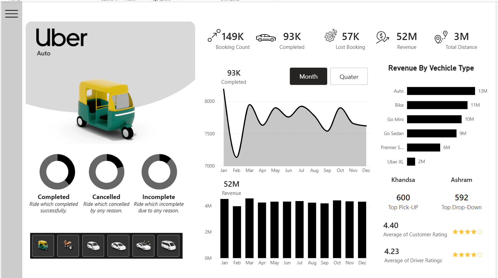
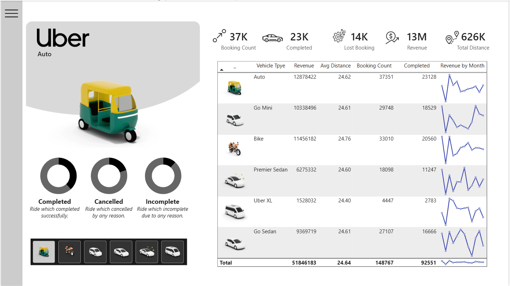
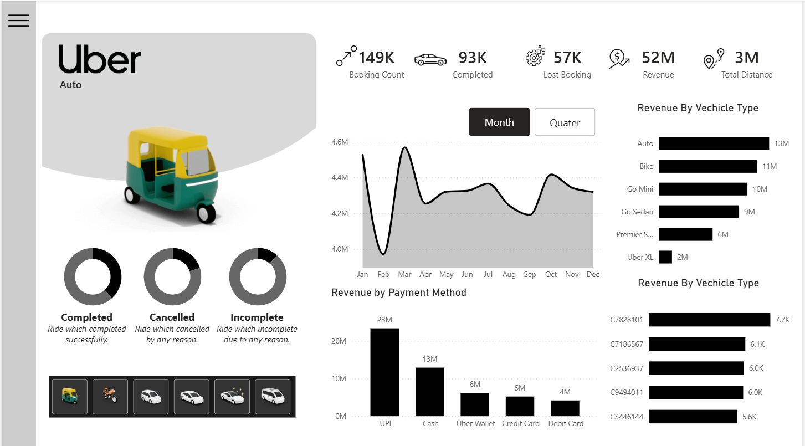

# 🚕 Uber Business Analytics Dashboard | Power BI

An interactive **Uber Business Analytics Dashboard** built using **Power BI, Excel, Power Query, and DAX** to analyze booking performance, revenue, vehicle performance, customer ratings, distance, and business trends.

---

## 📊 Project Overview

This project transforms Uber ride-booking data into an interactive Business Intelligence dashboard.

The dashboard provides a consolidated view of key operational and financial metrics and allows users to explore performance using interactive filters, vehicle selections, and monthly/quarterly analysis.

### Dashboard Pages

- 🏠 Home Page
- 📊 Overview
- 🚗 Vehicle Analysis
- 💰 Revenue Analysis

---

## 🎯 Business Objective

The objective of this project is to analyze Uber booking data and provide business insights into:

- Booking performance
- Completed and lost bookings
- Revenue performance
- Vehicle-level performance
- Monthly and quarterly trends
- Revenue by vehicle type
- Revenue by payment method
- Pickup and drop locations
- Total and average distance
- Customer and driver ratings

---

## 📌 Key KPIs

The dashboard tracks important KPIs including:

- **Booking Count**
- **Completed Bookings**
- **Lost Bookings**
- **Revenue**
- **Total Distance**
- **Average Distance**
- **Average Customer Rating**
- **Average Driver Rating**

The dashboard also provides interactive vehicle filters and additional report-level filtering.

---

## 📑 Dashboard Pages

### 🏠 1. Home Page

The Home Page provides an introduction to the Uber analytics dashboard and navigation to the main analytical pages.


---

### 📊 2. Overview

The Overview page provides a high-level summary of Uber business performance.

**Analysis includes:**

- Booking Count
- Completed Bookings
- Lost Bookings
- Revenue
- Total Distance
- Monthly Booking Analysis
- Monthly Revenue Analysis
- Monthly / Quarterly view
- Revenue by Vehicle Type
- Top Pickup Location
- Top Drop Location
- Average Customer Rating
- Average Driver Rating
- Completed, Cancelled, and Incomplete ride analysis



---

### 🚗 3. Vehicle Analysis

The Vehicle Analysis page provides detailed performance information by vehicle type.

**Metrics include:**

- Revenue
- Average Distance
- Booking Count
- Completed Bookings
- Revenue by Month
- Vehicle-level comparison



---

### 💰 4. Revenue Analysis

The Revenue Analysis page provides a detailed breakdown of revenue performance.

**Analysis includes:**

- Monthly Revenue Trend
- Revenue by Vehicle Type
- Revenue by Payment Method
- Revenue by Customer
- Monthly and quarterly analysis



---

## 🎛️ Interactive Features

The dashboard includes:

- Interactive filters and slicers
- Vehicle-level filtering
- Monthly and quarterly analysis
- Dynamic KPI monitoring
- Vehicle selection
- Detailed analytical tables
- Navigation between dashboard pages
- Hide/Show filter panel for a cleaner dashboard layout

---

## 🎥 Dashboard Demo

A complete Power BI dashboard demonstration is available as a separate video.

**▶️ [Watch the Full Power BI Dashboard Demo] (https://drive.google.com/file/d/1sbzhsc-gS4uKPx8nYYNPFMgi1OV1AA3G/view?usp=sharing)**

> Replace `YOUR_VIDEO_LINK` with your Google Drive or other hosted video link.

---

## 🛠️ Tools & Technologies

| Tool | Purpose |
|---|---|
| **Power BI** | Dashboard development and data visualization |
| **Power Query** | Data cleaning and transformation |
| **DAX** | Measures and analytical calculations |
| **Microsoft Excel** | Source data and data preparation |

---

## 💡 Business Areas Analyzed

The project covers the following business areas:

- Booking performance
- Revenue performance
- Vehicle contribution
- Payment methods
- Distance analysis
- Pickup and drop locations
- Monthly trends
- Quarterly trends
- Customer ratings
- Driver ratings

---

## 📂 Project Files

```text
Uber-Business-Analytics-PowerBI/
│
├── README.md
├── uber.pbix
├── uber.xlsx
│
└── Screenshots/
    ├── Home Page.png
    ├── Overview.png
    ├── Vehicle-Analysis.png
    └── Revenue-Analysis.png
```

---

## 🚀 Skills Demonstrated

This project demonstrates practical skills in:

- Data Analysis
- Business Intelligence
- Data Visualization
- Power BI Dashboard Development
- Power Query
- DAX
- KPI Development
- Data Cleaning and Transformation
- Business Requirement Analysis
- Interactive Dashboard Design

---

## 📋 Business Requirements

The dashboard was developed based on defined business requirements covering KPI monitoring, monthly and quarterly analysis, vehicle performance, revenue analysis, ratings, locations, and interactive filtering.

The current implementation focuses on the **Home, Overview, Vehicle Analysis, and Revenue Analysis** pages.

---

## 👨‍💻 Author

**Mahesh Panda**

Data Analytics & Business Intelligence Portfolio Project

---

⭐ If you find this project useful, consider giving the repository a star.
